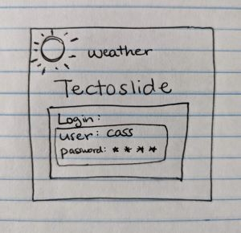
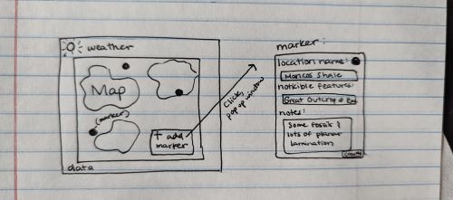
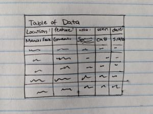

# TectoSlide
## Elevator Pitch
Do you remember a time when you saw an amazing geology feature and told yourself I better remeber this place, but then forgot it, or imagine you are on a road trip and want to see some amazing geological sites, but don't know where any are? TectoSlide allows you to create a marker on a map that represents the location of a geologic feature and a brief description that you can access whenever. That location is then visible to all others users on the website. At each marker created you can name it, write noticible features, and leave other notes for yourself or others. 

## Design
### Login Page:

### Main Page:

### View Data Page:

## Key features
+ Secure login over HTTPS
+ Up to date Map
+ Ability to view all the data inputed
+ Ability to see all markers created
+ Store geologic data relevent to the area
+ Create and label markers in any location

## Technologies
+ **HTML**- HTML is used to create the structure for the site. There will be three HTML pages overall. One page will be for the login. One page will be for displaying the map and adding markers and this will contain a hyperlink to second page which will be a database of all the markers that has been added recently. 
+ **CSS**- This will be used to style the page, so that it is appealing to use to the user.
+ **JavaScript**- This will provide the login, create the marker button and allower use to input data, displaying the marker, and displaying previous markers.
+ **Service**- Backend Service will Include:
  * Using Google Maps API
  * login
  * submitting created markers
+ **Database**- Will store the users, the data given from the marker which include, a created name, a geological feature desciption, other general notes, and the location of the set marker.
+ **Login**- This registers and login users. It will be securally stored in a data base. You can't get access to the map until you login.
+ **WebSocket**- Will include weather services to help the user view the current temperature and weather conditions for the day. 
+ **React**- This will allow for the site to use the react web framework. 
